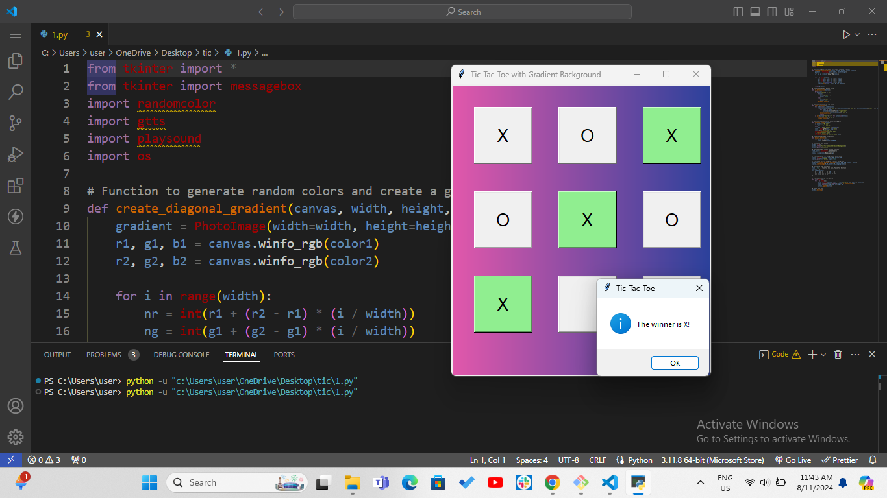

# 🎮 Tic-Tac-Toe with Gradient Background 🌈

Welcome to my Tic-Tac-Toe game, where you can play the classic game of Tic-Tac-Toe 🕹️ with a beautiful gradient background and an interactive sound announcement for the winner! 🎉

This project is built using Python with Tkinter for the graphical user interface (GUI), gTTS (Google Text-to-Speech) for winner announcements 🎤, and RandomColor to generate vibrant background gradients 🌈.

## 📂 Table of Contents 📂

1. Introduction 📖
2. Features ✨
3. How to Play 🎮
4. Installation 🔧
5. Usage 🚀
6. Technologies Used 💻
7. License 📄

## 📖 Introduction 📖

This project is a fun and interactive Tic-Tac-Toe game 🧩 where you can play against yourself or with a friend. The game features:

- A gradient background that changes colors 🌈.
- The option to play as X or O ❌⭕.
- Voice feedback that announces the winner using Google Text-to-Speech (gTTS) 📢.
- The game automatically detects the winner and displays a message box 🏆.

## ✨ Features ✨

- 🎨 Gradient Background: The background color changes dynamically to create a smooth gradient effect.
- 🔊 Voice Announcements: The winner is announced with a voice message.
- 🏅 Game Logic: The game includes logic to detect a winner or a draw.
- 🤖 Random Color Generator: The background uses a random color generator for each game session.

## 🎮 How to Play 🎮

1. Click on any empty square to place your mark (either "X" or "O").
2. Players alternate turns. The X player goes first. 🧑‍🤝‍🧑
3. The first player to get three of their marks in a row wins! 🏆
4. If all squares are filled without a winner, the game ends in a draw. 😔
5. Once the game ends, the winner (or draw) will be announced with sound and a message box. 🎤

## 🔧 Installation 🔧

To run this project on your local machine, follow the steps below:

1. Clone the repository:

`git clone https://github.com/SangeetaSharma73/TicTacToe.git`

2. Install dependencies: Make sure you have Python 3.x installed, then install the required packages:

`pip install -r requirements.txt`

## Dependencies:

- Tkinter (for GUI)
- gTTS (for voice feedback)
- playsound (for playing the sound)
- randomcolor (for generating random colors)

3. Run the game:`python TicTacToe.py`

## 🚀 Usage 🚀

Once the game starts, you will see a 3x3 grid where you can click to place your mark. The game will proceed with alternating turns for X and O, and once a winner is found or the game ends in a draw, the winner will be announced with a voice and a message box will pop up with the result.

## 💻 Technologies Used 💻

- Python 🐍
- Tkinter for GUI 🎨
- gTTS (Google Text-to-Speech) 🎤
- RandomColor for dynamic background 🌈
- playsound for sound playback 🎶
  
## 📄 License 📄
  This project is licensed under the MIT License - see the LICENSE.md file for details.

## Screenshot
- Here is the preview :

## 💬 Feedback & Contributions 🤝
If you find any issues or want to contribute to improving this project, feel free to fork the repository 🍴, open an issue 🐞, or submit a pull request 🔄.

This Tic-Tac-Toe game is an engaging way to practice your Python skills while having fun with the interactive features! 😄 Enjoy the game! 🎉

